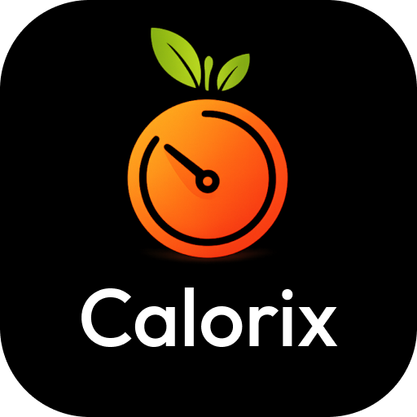

# 🥗 NutriPilot - AI Calories Tracker

<p align="center">
  
</p>

<h3 align="center">Your AI Nutrition Companion</h3>

<p align="center">
  A modern React Native Expo app with production-ready authentication
</p>

---

## 🎯 Project Overview

NutriPilot is a full-stack mobile application for AI-powered calorie tracking and nutrition management, featuring a production-ready authentication system.

### 📱 Frontend
- **React Native** with Expo
- **Expo Router** for navigation
- **TypeScript** for type safety
- **Beautiful UI/UX** with Dribbble-inspired design
- **AsyncStorage** for secure token storage

### 🔐 Backend
- **Node.js** with Express
- **MongoDB** with Mongoose
- **JWT** authentication (access + refresh tokens)
- **Email verification** system
- **Password reset** functionality
- **Role-based access control**
- **Two-factor authentication** ready

---

## ✨ Features

### Authentication
- ✅ Email/Password registration and login
- ✅ JWT token management with auto-refresh
- ✅ Email verification
- ✅ Password reset flow
- ✅ Google OAuth ready
- ✅ Two-factor authentication ready
- ✅ Admin user management

### UI/UX
- ✅ Modern gradient designs
- ✅ Professional authentication screens
- ✅ Form validation
- ✅ Loading states
- ✅ Error handling
- ✅ Tab navigation

### Coming Soon
- 🔄 AI food recognition
- 🔄 Calorie tracking
- 🔄 Nutrition database
- 🔄 Meal planning
- 🔄 Progress analytics

---

## 🚀 Quick Start

### Prerequisites
- Node.js v18+
- MongoDB (local or Atlas)
- npm or yarn
- Expo CLI (optional)

### 1. Clone the Repository
```bash
git clone <your-repo-url>
cd NutriPilot
```

### 2. Setup Backend
```bash
cd backend
npm install
cp .env.example .env
# Edit .env with your configuration
npm run dev
```

### 3. Setup Frontend
```bash
cd frontend
npm install
npm start
```

### 4. Create Admin User
```bash
cd backend
npm run seed:admin
```

**Default credentials:**
```
Email:    admin@nutripilot.com
Password: Admin@123456
```

---

## 📁 Project Structure

```
NutriPilot/
├── backend/                    # Node.js authentication backend
│   ├── src/
│   │   ├── controllers/        # Route controllers
│   │   ├── models/             # MongoDB models
│   │   ├── routes/             # API routes
│   │   ├── middlewares/        # Auth & RBAC
│   │   ├── lib/                # Utilities
│   │   └── scripts/            # Admin seeding
│   ├── .env                    # Backend config
│   └── package.json
│
├── frontend/                   # React Native Expo app
│   ├── app/
│   │   ├── (auth)/             # Auth screens
│   │   └── (tabs)/             # Main app screens
│   ├── services/               # API & auth services
│   ├── assets/                 # Images & assets
│   ├── .env                    # Frontend config
│   └── package.json
│
└── docs/                       # Documentation
    ├── QUICKSTART.md
    ├── SETUP.md
    ├── AUTHENTICATION_FLOW.md
    └── ...
```

---

## 📚 Documentation

### Getting Started
- **[QUICKSTART.md](./docs/QUICKSTART.md)** - 5-minute setup guide
- **[GET_STARTED.md](./docs/GET_STARTED.md)** - Welcome guide
- **[SETUP.md](./docs/SETUP.md)** - Detailed setup instructions

### Configuration
- **[ENV_SETUP_GUIDE.md](./docs/ENV_SETUP_GUIDE.md)** - Environment variables
- **[MAILTRAP_PRODUCTION_SETUP.md](./docs/MAILTRAP_PRODUCTION_SETUP.md)** - Email setup

### Development
- **[AUTHENTICATION_FLOW.md](./docs/AUTHENTICATION_FLOW.md)** - How auth works
- **[ADMIN_SEEDING.md](./docs/ADMIN_SEEDING.md)** - Create admin users
- **[TROUBLESHOOTING_LOGIN.md](./docs/TROUBLESHOOTING_LOGIN.md)** - Fix login issues

### Deployment
- **[EAS_BUILD_GUIDE.md](./docs/EAS_BUILD_GUIDE.md)** - Build for mobile
- **[FIX_CONNECTION_ISSUE.md](./docs/FIX_CONNECTION_ISSUE.md)** - Network setup

---

## 🔧 Configuration

### Backend (.env)
```env
NODE_ENV=development
PORT=5000
MONGO_URI=mongodb://localhost:27017/nutripilot_db
JWT_ACCESS_SECRET=your_access_secret
JWT_REFRESH_SECRET=your_refresh_secret
SMTP_HOST=live.smtp.mailtrap.io
SMTP_PORT=587
SMTP_USER=api
SMTP_PASS=your_mailtrap_token
EMAIL_FROM="NutriPilot <no-reply@nutripilot.com>"
```

### Frontend (.env)
```env
# For iOS Simulator
EXPO_PUBLIC_API_URL=http://localhost:5000

# For Android Emulator
EXPO_PUBLIC_API_URL=http://10.0.2.2:5000

# For Physical Device (use your IP)
EXPO_PUBLIC_API_URL=http://192.168.x.x:5000
```

---

## 🎯 Available Scripts

### Backend
```bash
npm run dev          # Start development server
npm run build        # Build for production
npm run start        # Start production server
npm run seed:admin   # Create admin user
npm run create:admin # Create custom admin
npm run test:login   # Test login credentials
```

### Frontend
```bash
npm start            # Start Expo dev server
npm run android      # Run on Android
npm run ios          # Run on iOS
npm run web          # Run on web
npm run test:connection  # Test backend connection
npm run check-setup  # Verify setup
```

---

## 🔐 Security Features

- ✅ Password hashing with bcrypt
- ✅ JWT token rotation
- ✅ HttpOnly cookies (web)
- ✅ Token versioning
- ✅ Secure token storage (mobile)
- ✅ Input validation with Zod
- ✅ CORS configuration
- ✅ Rate limiting ready

---

## 🧪 Testing

### Test Backend
```bash
cd backend
npm run test:login
```

### Test Frontend Connection
```bash
cd frontend
npm run test:connection
```

### Test Login Flow
1. Start backend: `cd backend && npm run dev`
2. Start frontend: `cd frontend && npm start`
3. Open app and login with admin credentials

---

## 📱 Building for Production

### Android
```bash
cd frontend
eas build --profile production --platform android
```

### iOS
```bash
cd frontend
eas build --profile production --platform ios
```

See [EAS_BUILD_GUIDE.md](./docs/EAS_BUILD_GUIDE.md) for details.

---

## 🤝 Contributing

Contributions are welcome! Please feel free to submit a Pull Request.

---

## 📄 License

This project is licensed under the ISC License.

---

## 👨‍💻 Credits

- **Authentication Backend**: Based on [nodejs_advanced_auth](https://github.com/Megagig/nodejs_advanced_auth) by Obi Anthony
- **UI/UX Inspiration**: Dribbble mobile app designs
- **Icons**: Expo Vector Icons (Ionicons)

---

## 🆘 Support

For help:
1. Check [docs/TROUBLESHOOTING_LOGIN.md](./docs/TROUBLESHOOTING_LOGIN.md)
2. Run `npm run check-setup` in frontend
3. Run `npm run test:login` in backend
4. Review the documentation in `/docs`

---

## 🎉 Quick Commands

```bash
# Setup everything
cd backend && npm install && npm run seed:admin
cd ../frontend && npm install

# Start development
cd backend && npm run dev          # Terminal 1
cd frontend && npm start           # Terminal 2

# Test
cd backend && npm run test:login   # Test credentials
cd frontend && npm run test:connection  # Test connection
```

---

<p align="center">
  <strong>Built with ❤️ for healthy living</strong>
</p>

<p align="center">
  <sub>Start your nutrition journey with NutriPilot! 🥗</sub>
</p>
